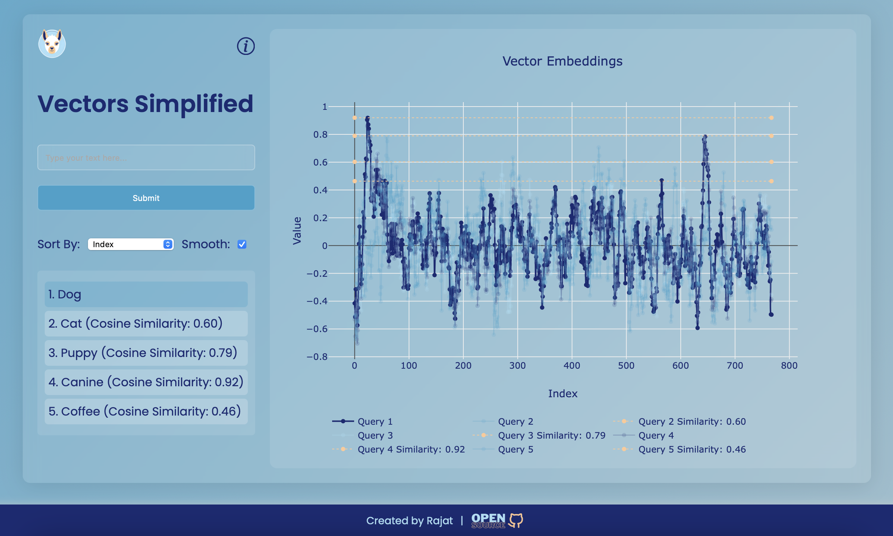

# Vectors Simplified

## Overview


This project is created to understand how similar different pieces of text are in a multi-dimensional space. This is a crucial concept in Natural Language Processing (NLP) tasks such as text classification, clustering, and recommendation systems.



> This project is part of [llamapp](www.github.com/rajatasusual/llamapp)

## Purpose

Vectors Simplified is a web application designed to visualize vector embeddings. This project provides a user-friendly interface to input text, generate vector embeddings, and visualize their similarities using interactive plots. The core of the application demonstrates the concept of cosine similarity between vectors, making it easier to understand how similar different pieces of text are in a multi-dimensional space.

## What are Vectors?

### Vector Embeddings

Vector embeddings are numerical representations of text that capture semantic meaning in a high-dimensional space. They are used in various Natural Language Processing (NLP) tasks such as text classification, clustering, and recommendation systems. Each vector consists of multiple components that encode information about the text's features.

- [Vector (Mathematics and Physics)](https://en.wikipedia.org/wiki/Vector_(mathematics_and_physics))
- [Understanding Word Embeddings](https://towardsdatascience.com/understanding-word-embeddings-88f3ff78a3e0)

### Cosine Similarity

Cosine similarity is a metric used to measure how similar two vectors are, based on the cosine of the angle between them. It ranges from -1 (completely dissimilar) to 1 (completely similar). It’s widely used in text analysis to determine how similar two pieces of text are based on their vector representations.

- [Cosine Similarity](https://en.wikipedia.org/wiki/Cosine_similarity)
- [Cosine Similarity in Machine Learning](https://towardsdatascience.com/cosine-similarity-in-machine-learning-4c78341a5a94)

## Basic Example of Cosine Similarity

Here’s a simple example of how cosine similarity works with basic vectors:

```javascript
function calculateCosineSimilarity(vec1, vec2) {
    const dotProduct = vec1.reduce((acc, val, idx) => acc + val * vec2[idx], 0);
    const magnitude1 = Math.sqrt(vec1.reduce((acc, val) => acc + val * val, 0));
    const magnitude2 = Math.sqrt(vec2.reduce((acc, val) => acc + val * val, 0));
    return dotProduct / (magnitude1 * magnitude2);
}

// Example vectors
const vectorA = [1, 2, 3];
const vectorB = [4, 5, 6];

const similarity = calculateCosineSimilarity(vectorA, vectorB);
console.log(`Cosine Similarity: ${similarity.toFixed(2)}`); // Output: Cosine Similarity: 0.9746
```

## Smoothing Function

When visualizing vector embeddings, especially when they contain a large number of items, the graph can become too clustered and difficult to interpret. To address this, a smoothing function is used.

### Purpose of Smoothing

The smoothing function helps in reducing the noise in the data by averaging the values over a specified window size. This makes the graph more readable and allows for better visualization of the overall trends in the data.

### Implementation of Smoothing

Here's how the smoothing function is implemented in the application:

```javascript
const smoothData = (data, windowSize) => {
    const smoothed = [];
    for (let i = 0; i < data.length; i++) {
        const start = Math.max(0, i - Math.floor(windowSize / 2));
        const end = Math.min(data.length, i + Math.floor(windowSize / 2) + 1);
        const window = data.slice(start, end);
        const average = window.reduce((sum, val) => sum + val, 0) / window.length;
        smoothed.push(average);
    }
    return smoothed;
};
```

The smoothing can be toggled on or off using a checkbox in the UI, providing flexibility to the user.

## Installation

### Prerequisites

1. **Ollama and Nomic-Text-Embed Model**

   - **Download Ollama**: Follow the instructions on the [Ollama website](https://www.ollama.com) to download and install Ollama.
   - **Run Nomic-Text-Embed Model**:
     - Ensure Ollama is running and accessible at `http://localhost:11434`.
     - Run the `nomic-embed-text` command in the terminal by calling 
      ```
      ollama pull nomic-embed-text
      ```
     - You can find the model details and setup instructions in the [Ollama documentation](https://docs.ollama.com).

    ### Why use Ollama and Nomic-Text-Embed Model?
    Ollama helps in running Language models locally, large and small. nomic-embed-text isA high-performing open embedding model with a large token context window.

2. **Install Node.js and npm**

   - Download and install Node.js from the [official website](https://nodejs.org/). This will also install npm (Node Package Manager).

### Install Packages

1. Clone the repository:
   ```bash
   git clone www.github.com/rajatasusual/realtime-vector-embeddings.git
   cd realtime-vector-embeddings
   ```

2. Install dependencies:
   ```bash
   npm install
   ```

## App Structure

### CLI Usage

1. Run the server:
   ```bash
   npm run cli
   ```

2. Start typing in the terminal to input text and get vector embeddings. The results and plot will be saved as `embedding_plot.png` in the current directory.

3. env file can be found in the project root directory with default settings

```
PORT=3000
EMBEDDINGS_MODEL=nomic-embed-text
EMBEDDINGS_BASE_URL=http://localhost:11434
SMOOTH=TRUE
```

### UI Usage


1. **Start the Web Server**:
   ```bash
   npm start
   ```

   This will start the server with the default port 3000.

2. Open `index.html`.

3. Use the input field to type text and click "Submit" to generate vector embeddings. The results will be displayed on the graph, and you can interact with it to view similarities.

4. **Smoothing Option**: Use the "Smooth" checkbox to toggle smoothing on or off for better visualization of the graph.

## License

This project is licensed under the [MIT License](LICENSE). See the LICENSE file for more details.